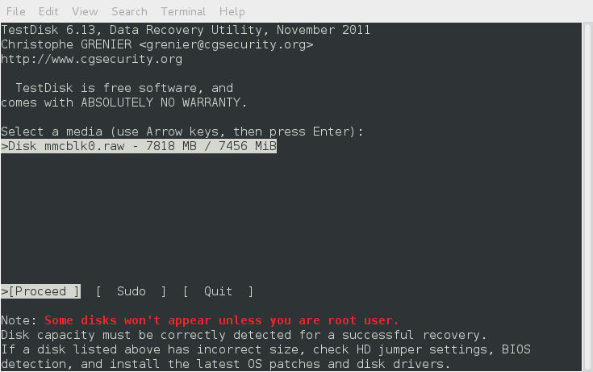
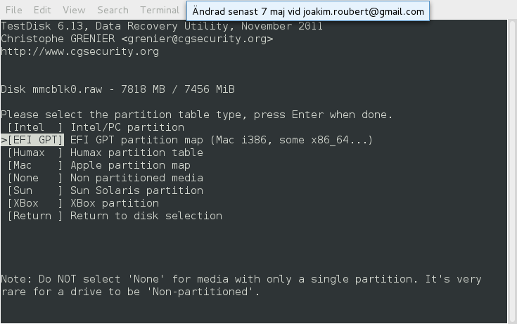
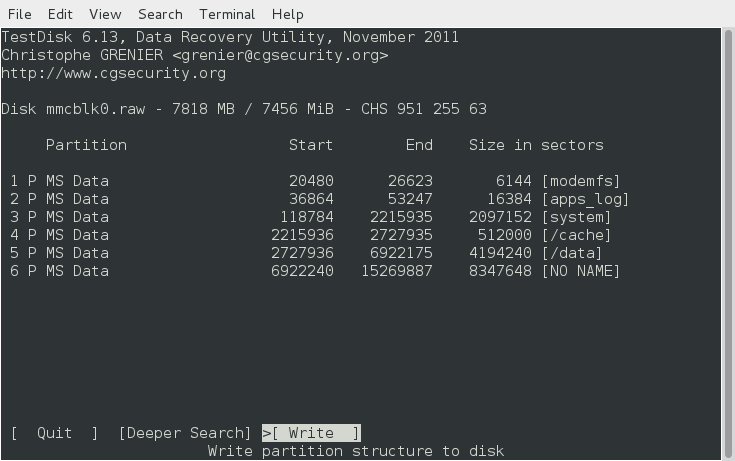
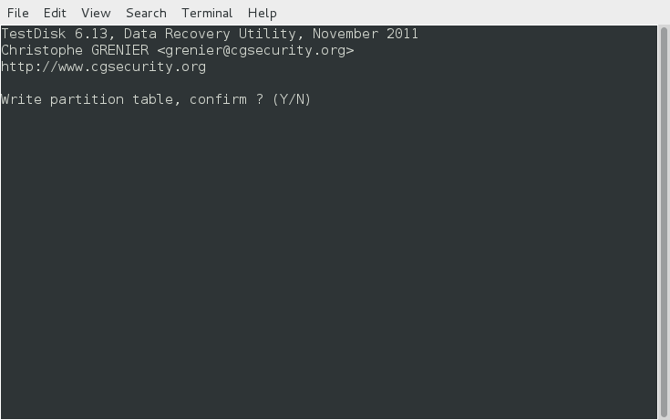
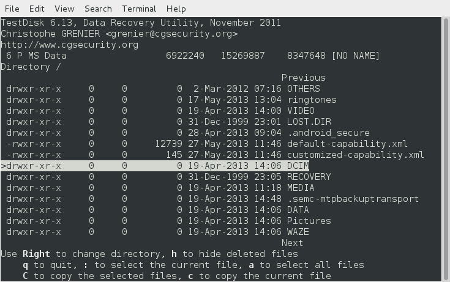
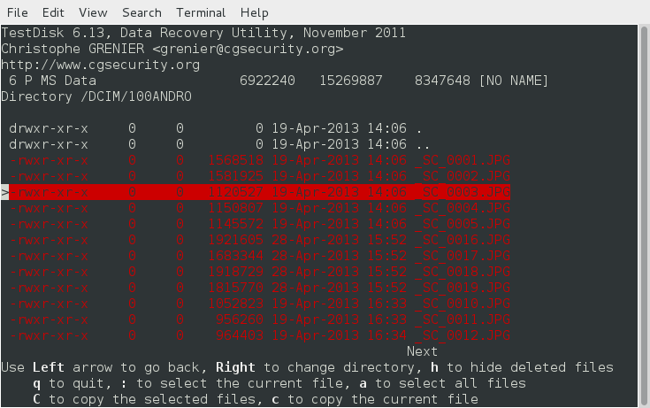

# Linux recovery file from android device or sd card :computer: :iphone:

This is a quick overview from

> [roubert android file recovery main source](https://roubert.name/joakim/androidfilerecovery/)

last one is useful for **android internal memory** here i'll highlight also for **sd card memory** recovery :metal:

### Prerequirement

- The phone needs to be rooted. That sucks (yes, I prefer to keep my things stock if possible!), but if the files are important enough the hassle is worth it. If your phone was already rooted, you are good to go.

- https://kingroot.net/

- [BusyBox](https://play.google.com/store/apps/details?id=stericson.busybox) installed on your Android device
  The [Android SDK](http://developer.android.com/sdk/) to get [adb](http://developer.android.com/tools/help/adb.html). Just download the (big) SDK, (unpack it)[http://developer.android.com/sdk/installing/bundle.html] and run adb from within.

- The programs [TestDisk](http://www.cgsecurity.org/wiki/TestDisk), [Pipe Viwer](https://code.google.com/p/pipeviewer/) (pv) and optionally [extundelete](http://extundelete.sourceforge.net/) (if we are to recover files from ext3/4 filesystems)

```bash
apt-get install testdisk pv extundelete
```

### Instructions

1. [Activate USB Debug on your device](http://developer.android.com/tools/device.html#setting-up) (in order to connect with adb)

2. Attach your device to the computer via the USB cable

3. Open a terminal on your computer, go to the Android SDK directory's subdirectory sdk/platform-tools (where adb is located)

4. Log in to your phone with adb shell:

   ```bash
   ./adb shell
   ```

   (NB: You might have to implicitly call adb start-server as root first if the command above fails.)

5) Now we can either use the mount command to find out what partition holds the SD Card data and dump that one, or we just dump out the entire memory content and skip the thinking part. I find the latter preferable, since the thinking part involved in the first approach is always prone to fail. So then you want to search for a block device called something like

   **VERY IMPORTANT** Unlike roubert recovery method which is useful for internal memory, here i also identify it for sd card.

   by convetion **internal memory** is

   ```bash
   /dev/block/mmcblk0
   ```

   **sd card** is

   ```bash
   /dev/block/mmcblk1
   ```

   ```bash
   shell@android:/ # ls /dev/block
   dm-0
   dm-1
   dm-2
   loop0
   loop1
   loop2
   loop3
   loop4
   loop5
   loop6
   loop7
   mmcblk0
   mmcblk0boot0
   mmcblk0boot1
   mmcblk0p1
   mmcblk0p10
   mmcblk0p11
   mmcblk0p12
   mmcblk0p13
   mmcblk0p14
   mmcblk0p2
   mmcblk0p3
   mmcblk0p4
   mmcblk0p5
   mmcblk0p6
   mmcblk0p7
   mmcblk0p8
   mmcblk0p9
   ram0
   ram1
   ram10
   ram11
   ram12
   ram13
   ram14
   ram15
   ram2
   ram3
   ram4
   ram5
   ram6
   ram7
   ram8
   ram9
   vold
   zram0
   shell@android:/ #
   ```

Here we see that there are several partitions within mmcblk0, but we leave it for TestDisk to take care of the partitions later.

6. Exit the shell to go back to the Android SDK directory's subdirectory sdk/platform-tools on your computer.

7. Now let us dump the content of that /dev/block/mmcblk0 that we found to the computer. With adb shell we can become superuser and execute cat to dump the content like this:

```bash
 $ ./adb shell su -c "cat /dev/block/mmcblk0" | pv > mmcblk0.raw
```

Pipe Viwer (pv) is optional, but I like to see the transfer progress information it provides.
(And of course you can change mmcblk0.raw to some other directory/filename if you want to.)

Addition: André Paixão wrote to me that he just got an empty file with the command above. He solved it by using [adbd insecure](http://forum.xda-developers.com/showthread.php?t=1687590).

Addition: Daniel Jeliński wrote to me that he ran into [issues with LF encoding](http://stackoverflow.com/questions/13578416/read-binary-stdout-data-from-adb-shell). The solution that worked for him was:

```bash
./adb shell su -c "cat /dev/block/mmcblk0" | pv | sed 's/^M$//' > mmcblk0.raw
```

...where ^M is what you get by pressing Ctrl+V followed by Ctrl+M.

Addition: Marc also ran into the LF problems, but solved it this way:

```bash
./adb shell "su -c 'stty raw; cat /dev/block/mmcblk0'" | pv > mmcblk0.raw
```

Addition: Tim de Waal wrote to me that he prefers using netcat/gzip instead:

On the Android device (adb shell with su), run:

```bash
dd if=/dev/block/mmcblk0 | gzip -9 | nc -l 5555
```

On the computer, run:

```bash
nc [AndroidIP] 5555 | pv -b > mmcblk0.img.gz
```

8. Now wait until the transfer is done. For a 8 GB device it does not take too long, but still there is time to check some e-mails and browse the web while it finishes.

9. With the dump on the Linux machine's file system, now we can let TestDisk take it from there:

```bash
$ testdisk mmcblk0.raw
```

10. First restore the GPT partition table. Select mmcblk0.raw in the TestDisk interface and choose Proceed:

Choose EFI GPT partition map:



Then select Analyse in order for TestDisk to find the partitions:



Choose Quick Search:


Hopefully the search will return a nice table like this:


Then just press enter to continue.


Select Write to write this new(ly recovered) partition table. Then confirm with Y:



You will then be informed that you need to reboot. But in our case there is no need for that. Just press enter to continue:



Now the partition table is restored, and we can go on and try to recover the files.


Select Advanced to use TestDisk's Filesystem Utils section:


Select the partition where you want to do the recovery. In this example, we want to recover photos from the FAT32 SD Card partition with the Undelete option:


Now we can browse the filesystem for files that can be recovered:



In the /DCIM/100ANDRO directory, where my Android device stores its camera images, we find a lot of files that can be recovered. Select all or some of them, and use either C or c to recover them to one of the Linux computer's file systems (e.g. your home directory):



Done!

Optional: To recover files from an ext3/ext4 partition, TestDisk has an option Image Creation that will write an image called image.dd of that partition to a file on the Linux computer's file system:


Then you can use extundelete in your terminal window to recover files from the image:

```bash
extundelete --restore-all image.dd
```

Thank you very much Mathias Brodala, Piotr Biesiada, André Paixão, Marc, Daniel Jeliński and Tim de Waal for sharing your valuable update suggestions and corrections.
