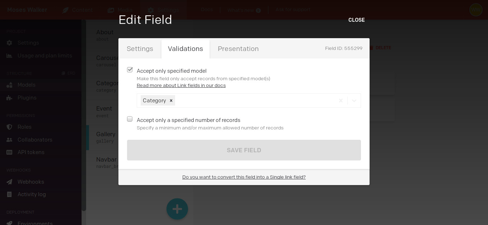

# How to create categories in DatoCMS for a Gallery? 🤔

Right now i'm working on non-profit project using [DatoCMS](https://www.datocms.com/) which is a headless CMS ( content management system ).

## Quick Intro

So what is exaclty an headless CMS?. Well it separate the presentation layer from the content. So instead you send the whole html,css,js bundle to the browser, you just make a request via API Endpoint, using [GraphQl](https://graphql.org/) to sum up, is a way to consume data in a composable way.

What does it mean?. Quick thought exercise. Imagine this:

```ts
class User {
  id: number
  first_name: string
  last_name: string
}

class Book {
  id: number
  title: string
  description: string
}
```

and Devops fellas have design the API like this:

```ts
http://library.io/api/user

http://library.io/api/product

```

So if you want to get all user that get the title book name, you might think need another API Endpoint right?. Well this is the traditional REST. With GraphQl you can create composable request.

```ts
{
  User {
    id
    first_name
    Book {
        title
        description
    }
  }
}
```

So, you are consuming what you need without another API Enpoint, which also helps for security, by reducing the API surface.

## Create an account and register

Once you create an account and [register](https://dashboard.datocms.com) to, Let's me explain important **concepts** in a quick and understandable way.

### Models

Are a friendly editor way interface over the database (it's like the tables on a DB).

### Content

This is where you fill your models with data ( it's like a row on a DB )

Saying so, now let's go to see how we can implement categories.

## Creating categories for a Carousel

- Create the model "Category"

- In field type click on "Text" in the submenu "Single-line string"

- In Content Area, add your categories.

- Create the model "Gallery" with a Type Title

- Then for the categories section, create a field type "Links"


- Link your type field with the "Categories" model.



- Go to Content Area, click on "Gallery" item, click "+ NEW RECORD", and you'll be able to set link your "Categories" model with the "Gallery"


and VOILÁ!.

Check the pricing section for more info.

[Dato CMS Pricing](https://www.datocms.com/pricing/)
