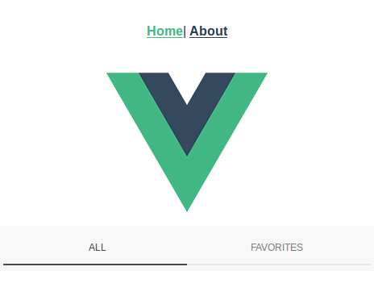

# Ionic-Vue Workflow for a single app

Today i'm gonna work with [Ionic with Vue](https://github.com/ionic-team/ionic/blob/master/vue/README.md).

So first i'll follow the [Ionic Guide](https://ionicframework.com/docs/intro/concepts)
and make a briefly summarize of core concepts.

### UI Components

Ionic Framework is a library of UI Components, that a reusable and follow [web standards](https://www.w3.org/standards/) using HTML, CSS, Javascript. Also it's highly customizable.

### Platform Continuity

Is a built-in feature that allow app developers use component and run such applications with look & feel to which platform is running. For iOS it use [iOS design language](https://www.apple.com/ios/ios-12/) and for Android & PWA (By default) it use [Material Design](https://material.io/guidelines/).

### Navigation

Ionic v.4.0.0 also know as **Neutronium**, define so far two kind of navigation.

- Browser navigation

  It's a linear history navigation stack, you go forward or back

- App navigation

  Often use parallel, non-linear navigation, example: you can have a tabs with three items (Home, Like, Contacts) where one of them leads to another pages.

### Native Access

By using web view to run ionic apps, it can be run virtually in anyplatform: Desktop, mobile, refrigerators, cars...

Thanks to [Cordova](https://cordova.apache.org/) & [Capacitor](https://capacitor.ionicframework.com/), developers are able to access to native directive easily.

### Theming

At the core Ionic Framework is using Css and with Css Variable now is more easy to customize your applications. Ionic theme also encourage to modify the colors to match a identity branch.

**OK ENOUGH** with the core concepts. Let's get's our hands dirty.

## Requirements

- [Git](https://git-scm.com/)

- [Node](https://nodejs.org/en/)

  For linux a [node manager version](https://github.com/creationix/nvm)

Create a repo on github and later.

```bash
git init
npm install -g ionic
```

here i'm gonna clone a [Ionic vue starter](https://github.com/W4G1/ionic-vue-starter) from [Walter van der Giessen](https://github.com/W4G1) (All thanks goes to him).

```bash
git clone https://github.com/W4G1/ionic-vue-starter
```

This repo actually comes with 3 powerfull, widely use and a huge community support tools such as [Vue-router](https://router.vuejs.org/), [Vuex](https://vuex.vuejs.org/) and [Vue-cli](https://cli.vuejs.org/)

```bash
npm install -g @vue/cli
git clone https://github.com/W4G1/ionic-vue-starter
npm install
```

after that, for local browser development

```bash
npm run serve
```


Let's see if this **really** working. In the **HelloWorld.vue** component i set a **basic toolbar** from Ionic.

```vue
<ion-toolbar>
  <ion-segment>
    <ion-segment-button value="all" checked>All<ion-segment-button>
    <ion-segment-button value="favorites">Favorites<ion-segment-button>
  </ion-segment>
</ion-toolbar>
```

And it worked



::: warning
Due the recently adopt of vue from Ionic team, you should go with carefull to avoid cancer colon from frustation.
:::

This is under heavy development right now, **@ionic/vue** still in **alpha** stage to this date **(14/3/19)**.

[Ionic Team Vue](https://github.com/ionic-team/ionic/blob/master/vue/README.md)
