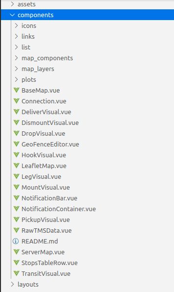

# Startup ask me to migrate their VueCLI project to Nuxt

31th December 2019, i receive an Upwork invitation from a client in New Hampshire, USA. 

It's a startup which main focus is on identify wait time in line from trucks waiting to load/unload it's cargo in a particular yard.

It's actually pretty interesting due it will help clients to identify why it takes too much time, and notify them while reducing the cost at identify such issues.

So, i got a couples of things to consider in my experience doing such migration. 

## Why?

Actually the project is using VueCLI 3, which is a great way to start for small applications, but when that grow on complexity we’ll need a better way to handle such beast.
So our option here is to migrate to Nuxt.

Doing this migration in the future will be easy to set up for:

- Widgets
- UI Frameworks
- SPA, SSR, PWA
- Plugins
- Third party libraries
- Typescript Support
- Testing Frameworks

## How?
We’ll create a new Nuxt Project, and migrate page by page.

- Migrate some technologies first and dependencies
- Typescript
- Typescript files
- Import Dependencies

## Main Challenges Faced

- Migration with the minimal change on codebase
- Integrate Vuex-Nuxt in a Typesave
- Lack of convection for Vuex Store Actions
i.e. some actions return the “state” objects other not
Passing Props as Paramets using Nuxt-link it’s a tweaky way
- Passing Props as Paramets using Nuxt-link it’s a tweaky way

## Not all migration are equal

In my experience this are things to considered important to do is:
 
 - **Identify** Components to migrate
 - **Find patterns** for **similar** Component to migrate

Once you do this, then automate the migration process.

## Final Folder Architecture

Components 

Page

## Hours taken

37:00 hrs 

source from Upwork.

After that, there is something else to do it, we must now take of the look & feel of the application. 

The front-end. 

Which is something i'll explain in the next entry.

